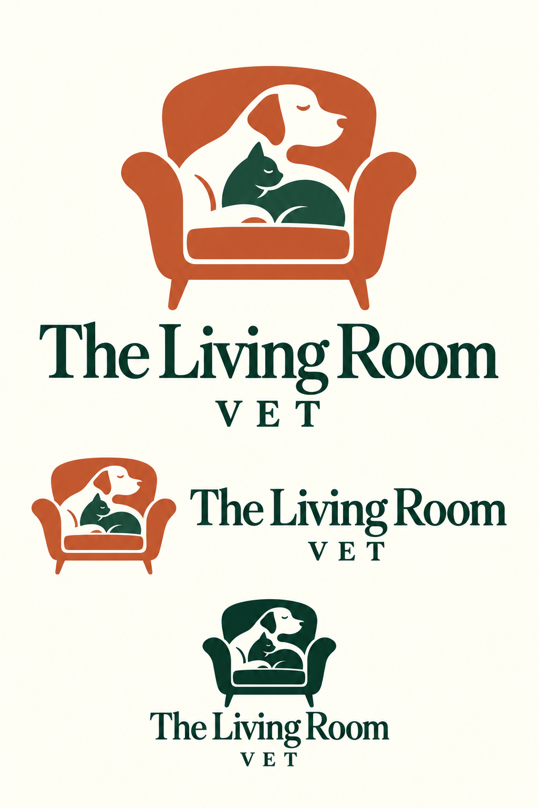

# Living Room Vet brand direction

The practice owner approved developing the armchair with a dog and cat. Keep the welcoming, relaxed animals, rounded chair, terracotta, forest green and ivory direction.

This is a raster development board, not finished vector artwork or a deployed logo. It explores stacked and horizontal wordmarks and a single-color treatment. The generated lettering and geometry vary between lockups; final assets must use one consistent master. Small-size silhouettes and spacing require review before use on certificates, signs or browser tabs.

## Production work

- Build one editable master with consistent animal/chair geometry and properly spaced wordmark.
- Export stacked, horizontal and standalone marks in color, single color and reversed treatments.
- Check recognition at favicon/mobile sizes and legibility in monochrome print.
- Define palette tokens, clear space, minimum sizes and licensed typefaces.
- Replace application assets through a reviewed brand integration change.

## Generation provenance

Created with the built-in image generation tool using the previously approved logo concept as reference. No live website assets were replaced.

Prompt: Develop the approved reference into a refined brand identity presentation for The Living Room Vet. Preserve the rounded armchair, relaxed dog facing right and curled cat beneath, warm terracotta/deep forest green/ivory palette. Improve smooth contours and simplify tiny facial and fur details. Show a primary stacked logo, horizontal lockup and compact single-color mark on ivory. Exact words: “The Living Room” and “VET”. Characterful serif, clear word spacing, consistent geometry; flat colors without gradients, glow, shadows, texture, photography, extra animals or tagline.
