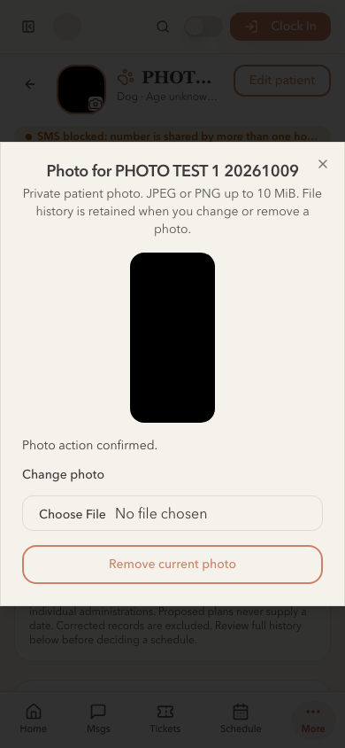

# Patient photos — hosted rollout receipt

**Status:** PR #232 merged; staging and primary backends deployed; production frontend READY. Engineering rollout is complete. Practice acceptance remains pending.

Dave approved merging #232 and the staged rollout. Reviewed head `0d98918042d32361042634732d2775df02f4ac41` passed [all CI jobs](https://github.com/finite0001/livingroom-vet-care/actions/runs/37961854969). The merge commit is `7cf7fbfdf9a8b774da6964164f3d00e97423fd5f` (2026-10-09 21:06:04 UTC); its tree is identical to that reviewed head.

Vercel publishes main automatically. To preserve deployment order, staging was verified first, then the primary migration and verifier were prepared before merging the frontend.

## Backends

Both CLI dry runs selected exactly `20261009160543_patient_identity_photos.sql`. Both pushes applied only that migration, using explicit project references and `--skip-vault`; no seed, role-file or provider configuration deployment was included.

| Environment | Project | Migration count | Verifier |
|---|---|---:|---|
| Staging | `kothoqicubowyhwfsrte` | 169 | ACTIVE, version 1, verify_jwt=true |
| Primary | `mgadheotkdnrsatfivjy` | 169 | ACTIVE, version 1, verify_jwt=true |

Both deployed verifiers have the same bundle SHA-256: `acd38680d9bd0ea49a0e93655375cddc3746e541495ecc1b3f61208e8719875c`. The per-function import map was included. The retained Lovable project was not a target.

[Reproducible role/metadata probes](../../scripts/rollout/patient-photo-probes.sql) passed **29 checks in each environment**. They simulate database roles with an existing active administrator; they do not claim an HTTP sign-in or actual image-byte verification. Every synthetic client, patient, document, Storage metadata row, selection and audit write rolls back inside a subtransaction, with unchanged counts asserted afterward.

Checks cover PNG normalization/size/digest rules, immutable reservation retries, unverified selection refusal, service-only proof, object replacement/hash/dimension refusal, verified pending retention, finalization, cross-patient refusal, server actor stamps, idempotent selection, stale changes, direct-write denial, void/removal history, historical replay, inactive/unassigned actors and anonymous denial.

Primary remains at **1 client, 1 patient, 0 documents, 0 photo states and 0 photo actions**. No existing primary patient data or image was changed. A real unauthenticated production verifier request returned **401**.

## Hosted staging workflow

The tested Git preview is `dpl_GDgkEn9TRfhJNCm8vbeRrxcJA4P9`, source `0d98918`, URL `livingroom-vet-care-odal1dx32-daves-projects-e0da43ba.vercel.app`. Its deployed bundle `/assets/index-Ci7Edpj2.js` references only the staging backend. The stable staging alias `livingroom-vet-care-daves-projects-e0da43ba.vercel.app` now points to it. Vercel protection remained enabled; tests used the caller's scoped development authentication.

Two clearly labeled synthetic staff accounts, one synthetic household and two synthetic pets were created only on staging. Browser tests used genuine password sign-in and the actual hosted application, Auth, RPCs, private Storage and Edge Function:

- Desktop JPEG upload normalized to PNG and displayed through authorized signed access.
- Invalid PNG replacement was refused, preserving the prior image.
- Mobile PNG replacement succeeded at a 390×844 viewport.
- Removal cleared the current image while retaining private document/file history.
- A second active staff member could read the current photo and retained original; anonymous Storage download was refused.
- The second pet's photo state remained version zero.
- Both successful verifier calls in the completed run returned **200**, with captured dimensions 800×400 and 300×600.
- The completed browser run reported **0 page errors**.

An initial automation run submitted its replacement before the file input had re-enabled after error recovery. The harness was corrected to wait for the enabled input; no application change was needed. Its earlier successful JPEG remains in retained history. The fixture therefore has three retained ready images and final current-photo version 4 with no selected document.

After verification, both synthetic pets were archived, both owned test staff accounts were deactivated and banned, and inactive read refusal was checked. The synthetic household and private history remain intentionally labeled; no SMS consent, invoice, appointment or care reminder was added.

## Production frontend

Production deployment `dpl_DeHiDSvx6Anq6tNBEMPoHTxBPw3d` is **READY** at merge commit `7cf7fbf`. It serves [thelivingroom.vet](https://thelivingroom.vet), `www.thelivingroom.vet` and `livingroom-vet-care.vercel.app`. Its URL is `livingroom-vet-care-1lt7bbfj8-daves-projects-e0da43ba.vercel.app`; published bundle `/assets/index-BaSj1ROf.js` references only primary `mgadheotkdnrsatfivjy`.

The existing authenticated owner session loaded the patient list and existing chart, including the new photo control and existing clinical/navigation content. Browser automation lost its connection during the final dialog interaction, so no claim is made about a completed production upload or enabled file input from that interaction. Complete upload/change/remove behavior was verified on hosted staging; primary write rules were exercised only through rolled-back probes.

Vercel's rollout error scan found **0 entries in the preceding 30 minutes**. This static frontend's scan does not establish global backend health.

## Advisor observations and acceptance limits

Security advisors were run on both projects. Each reported **415 WARN findings**: 405 authenticated SECURITY DEFINER notices, 8 anonymous SECURITY DEFINER notices, one extension-in-public notice and one leaked-password-protection notice. There were also 131 existing INFO findings for service/internal tables with no RLS policy; none concerns a photo table.

The four new photo notices are the intended authenticated RPCs with explicit active-staff, ownership and version checks. Those boundaries passed the hosted probes and staging HTTP/browser workflow. See the [authenticated SECURITY DEFINER advisory](https://supabase.com/docs/guides/database/database-linter?lint=0029_authenticated_security_definer_function_executable). No global clean-security-audit claim is made.

The rollout preserves generated Supabase types, existing clinical history, provider settings and private-file retention. It does not mark all-features launch acceptance complete. Whogot is the next implementation package; Susan's practice acceptance and remaining October requirements remain open.
