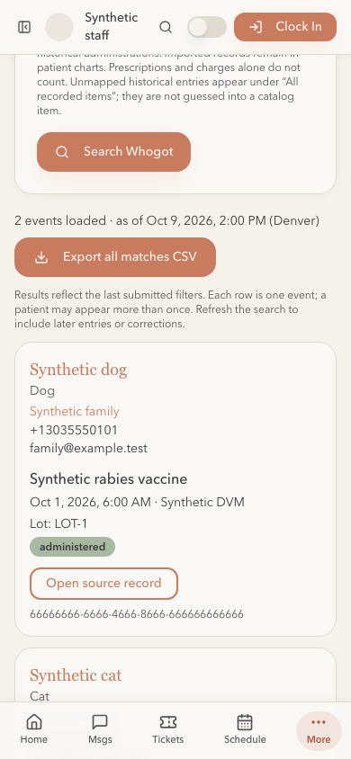

# Whogot implementation and local verification — October 9, 2026

Status: implemented on `feat/whogot-20261009`, awaiting review, the required CI checks, specific merge approval and hosted rollout. Neither hosted database was changed for Whogot. This receipt is engineering evidence; practice acceptance remains pending.

## Delivered behavior

- **Whogot** buttons on Patients and Inventory, including a product-specific entry. Search by stable catalog product, event type, inclusive Denver dates, exact lot, species and clinician / dispensing staff name.
- Separate administration, actual native dispensing and explicit service performance. Unsigned or signed prescriptions and invoice-only services are excluded. A multi-lot dispense produces one event. A dispensing annotation labels the event without erasing physical dispensing.
- Staff-only keyset pagination and CSV export under the same filters and search timestamp. CSV prevents formula execution, cancels on account changes or leaving the page, rejects duplicate events and exports up to 10,000 events without silently truncating.
- Results identify patient, household contacts, patient status, event, original item name, lots, staff, historical evidence and correction status. Patient-scoped direct source views expose originals and current corrections even beyond the chart's first history page.
- Explicit service completion in a saved patient encounter, with performing clinician, completion time and notes. Recording performance does not create a charge. Original events and attributed corrections are immutable, audited and protected by RLS. Requests retain their exact operation ID after an interrupted response so retry cannot create another event.
- New service entries require an active patient, its own saved encounter, an active service item and a named active clinician. Cross-patient writes, future performance, inactive items and reused operation IDs with altered payloads fail.

Previous item names already attached to a catalog ID are searchable aliases. Unlinked historical names are not guessed into a product. Search includes native practice events and manually entered historical administrations; retained imported records remain available in patient charts and are outside this query. Historical administration entries and corrected originals are explicit opt-ins.

The search timestamp bounds event and correction timestamps across pages. Patient and household details are read currently; pagination does not hold a long database transaction or freeze concurrent household edits. Source views deliberately show current corrections. Staff should refresh the search before acting on an older export. Whogot does not send communications.

## Verification

A uniquely labelled disposable local Supabase project, `lrv-whogot-058f33fc89`, replayed all **170 migrations**. Its container labels and working directory were checked before database work and cleanup. All fixture records were synthetic; no hosted reads/writes or provider messages were required. Its containers and data volumes were removed after verification.

- `npm run check`: lint and TypeScript passed, **1,278 unit tests passed**, production build passed. Four existing React Fast Refresh warnings and the existing large patient-page bundle warning remain.
- Full `supabase test db supabase/tests`: **135 files, 5,500 assertions passed**. Whogot contributes **63 checks**, including calendar boundaries on Denver's 23-hour spring-forward day, current correction exclusion, historical opt-in, two-lot deduplication, stable cursor ordering, alias identity, direct source scope and anonymous/inactive denial.
- Actual local Auth/PostgREST: **16 checks passed**, including service save/replay, authenticated search, source identity, correction replay, snapshot eligibility and denied anonymous/inactive access.
- Five observed PostgreSQL lock races passed: exact service retry, changed payload under the same ID, exact correction retry, conflicting corrections and concurrent patient archival. Each second transaction was observed waiting on its blocker; only the intended winner committed.
- Browser coverage includes the three new Whogot scenarios plus patient, patient-list, Patient 360, clinical and inventory regressions. The initial 30-scenario run passed 25; five local page-loading timeouts were investigated. Traces showed unfinished dev-server module requests without page exceptions. Two passed an ordinary isolated rerun; the remaining three passed a local diagnostic run with a 20-second assertion timeout. A final six-scenario run (all three Whogot cases and the remaining three regressions) passed with the ordinary committed timeouts. Committed Playwright timeouts were not changed.
- Restore-rehearsal safeguard unit tests: **10 passed**. The three migration-count tripwires and restore migration inventory now include migration 170.
- Local Supabase security advisor: only the pre-existing `pg_net` extension-in-public warning; no new table RLS findings. This is not a hosted security-audit claim. RPCs revoke public/anonymous/service-role execution and explicitly grant authenticated execution. Every privileged read/write checks active staff; the service-history reader retains invoker/RLS semantics.

## Rollout after approval

1. Verify project identities and migration inventories: staging `kothoqicubowyhwfsrte`, primary `mgadheotkdnrsatfivjy`; legacy Lovable `ugpyjacqganaqtsiekay` is not a target.
2. Dry-run and apply only `20261010021254_whogot_and_performed_services.sql` to staging. No new Edge Function deployment is needed.
3. Verify staged active-staff search and source access, denied anonymous/inactive calls, an explicitly labelled synthetic performed service, exact retry and correction. Confirm the preview frontend points only to staging.
4. Repeat bounded rollback probes on primary and apply the verified additive migration before approving the main-branch merge; Vercel automatically publishes merged frontend code.
5. Match the specifically approved PR head, merge, and verify the READY production deployment's commit and primary backend binding. Preserve messaging, payment and provider commissioning gates. Retain the service ledger if a frontend rollback is required.
6. Record hosted evidence separately and obtain Susan's practice acceptance for received-care interpretation and the service-entry workflow.

The service ledger appears in the patient chart. Adding these new service events to client medical-record release bundles belongs to the planned records-release work; this change does not silently change existing signed release artifacts.
