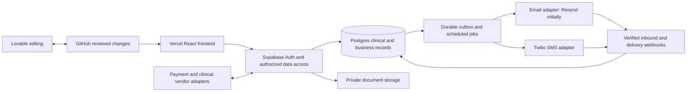

# Proposed architecture and data contracts

## Keep one application and one clinical source of truth

This is a proposed design. Use Supabase Edge Functions for server-side integrations and a persistent job mechanism for retries/reminders. Vercel hosts the frontend; Supabase hosts database/auth/storage/backend functions. Keep providers' secrets out of browser bundles. Do not add a second application backend just to deploy on Vercel.

## Data model

Retain existing `clients`, `pets`, `conversations`, `messages` IDs wherever possible. Add migrations rather than replacing history. Table names below are proposed contracts to finalize in phase 1. New Living Room encounters belong to this system; external clinical records retain their source and read-only provenance. Continuing external sync requires field ownership rules rather than assuming this app can overwrite the source.

| Domain | Existing data to evolve | New structures |
|---|---|---|
| Practice/access | profiles, user_roles, app_settings | practices, practice_memberships, practice_locations, audited practice settings |
| Clients/patients | clients, pets, client_files | client_addresses, client_contacts, patient_weights, patient_contacts/ownership history |
| Clinical core | pet free-text fields, client_notes | encounters, soap_notes, clinical_addenda, patient_problems, patient_alerts, document_versions |
| Prevention/labs | pet_vaccinations, lab_results, wellness_reminders | care_protocols, protocol_versions, patient_care_plans, care_due_events, lab_orders |
| Scheduling | appointments, appointment_reminders | appointment_resources, availability, service_types; evolve appointments with visit location/type |
| Communication | conversations, messages, attachments, sms_consent | mailboxes, conversation_participants, conversation_patients, conversation_reads, message_deliveries, provider_events, outbound_jobs |
| Inventory | pet_vaccinations.lot_number | products, product_lots, stock_locations, stock_movements, dispensing_events |
| Billing | payment_links | invoices, invoice_items, payments, refunds, payment_allocations |
| Charts | none | dental_charts, anesthesia_records, anesthesia_observations, qol_assessments, body_maps, lesions, lesion_observations |
| Documents | client_files, message_attachments | generated_documents, document_shares, record_packages, release_audit |
| External PIMS | ezyvet_id and placeholder route | integration_connections, external_entity_links, sync_runs, sync_cursors, import_staging, import_conflicts |

## Invariants

1. Every protected operation verifies the authenticated actor (`session.user.id` / server-verified JWT), active membership and role; database RLS enforces the same scope. Clinical records belong to the practice, not exclusively the staff member who created them. Record `created_by`/`updated_by` from authenticated identity, never trust a client-provided actor. Scheduled workers use narrowly authorized service identity, practice scope, originating actor and audit metadata.
2. Add `practice_id` to protected shared records and backfill the one practice. Validate parent-child practice consistency through composite constraints or equivalent enforced checks. No UI filter substitutes for RLS. No anonymous direct reads of clinical tables.
3. Preserve signed clinical notes and issued certificates as immutable versions; corrections are attributable addenda or superseding documents. Archive patients rather than cascading deletion through medical history.
4. Store date-only birthdays, vaccine dates and due dates as dates; appointments and message events as UTC timestamps. Display/schedule in `America/Denver` with daylight-saving tests. Derive age from DOB; unknown and approximate birthdays must remain distinguishable.
5. Store weight with a canonical unit and original measurement/unit. Store money in integer minor units plus currency; snapshot prices and tax calculations on issued invoices.
6. Inventory quantity changes are ledger entries. A stock-consuming clinical action and its charge commit atomically with a unique action key. Retries cannot consume stock or add charges twice. Catalog changes must not alter historical dose/lot/manufacturer/price snapshots.
7. A message has separate queued, accepted, delivered, failed and bounced states. Persist send intent before dispatch; provider response does not equal receipt. Unique provider event IDs and message keys handle duplicate/out-of-order webhooks. Ambiguous timeouts go to reconciliation rather than blind resending, especially where provider idempotency is unavailable.
8. Email provider IDs and RFC Message-ID/References are different fields. Use stable practice Reply-To addresses, not staff personal accounts. Unknown sender or ambiguous household match goes to a review queue. Client identification is not patient identification.
9. Private files require authorized relationship checks, MIME/size validation and safe HTML rendering. Quarantine untrusted inbound attachments before normal access. Document links are scoped, expire and are revocable; audit issuance/access. Email attachment copies cannot be revoked after sending, so require recipient and package preview.
10. Due events are separate from delivery jobs. Completing care, changing a plan, rescheduling, opting out, or marking a pet deceased cancels/suppresses obsolete work. Check current eligibility again immediately before dispatch.
11. Check every Supabase error; do not silently lose audit rows or file operations. Use transactional RPCs for coupled database changes and explicit recovery steps for storage/provider side effects.

## UX structure

Staff navigation: Today, Schedule, Inbox, Clients & Patients, Inventory, Billing, Reports, Settings. Patient workspace: Overview, Visits/SOAP, Problems & Alerts, Vaccines, Labs, Medications, Dental, Anesthesia, QOL, Body Map, Documents, Communications. Use a persistent patient identity and warning header; keep a visible save/sync indicator.

Reuse `src/hub` shell and shadcn components. Introduce bounded feature folders under `src/hub/features/` rather than one large patient page. Use interfaces for object shapes, `cn()`, mobile-first Tailwind, semantic tokens and React Query. On small screens use stacked inbox/list/detail views; on desktop use list, conversation and patient-context panes. Urgent clinical status uses text/icon in addition to red.

## Environment and migration policy

First establish whether the configured backend is already practice-owned Supabase or Lovable Cloud. If owned, improve environments without a gratuitous data migration. If moving, rehearse migrations, data/files, auth, secrets, functions, scheduled jobs and provider callbacks into staging. Check counts, relationships and file hashes; repair schema drift explicitly. Existing Lovable Cloud user passwords cannot simply be exported; plan password reset if migrating users.

Use isolated staging and production projects; previews must never send real reminders or mutate production data. One reviewed migration path through GitHub; coordinate Lovable pushes and inspect/rebase conflicts before merge. Validate environment destinations before applying migrations. On cutover pause writers and delivery jobs, reconcile final data, switch endpoints, then enable only one sender. Define rollback before accepting new writes; do not switch databases back without reconciling post-cutover records.

## Testing strategy

Unit tests for reminder precedence/date boundaries, invoice arithmetic, chart revisions and document inclusion. Database integration tests for RLS, atomic stock/charge events and clinical immutability. Provider contract tests for signatures, replay, duplicate sends, invalid recipients, bounces, opt-out and attachment isolation. Browser tests for the end-to-end visit and reset/invite flows. Manual veterinarian acceptance for certificates/charts and staff usability. Rehearse backup restoration and a provider outage before launch.
